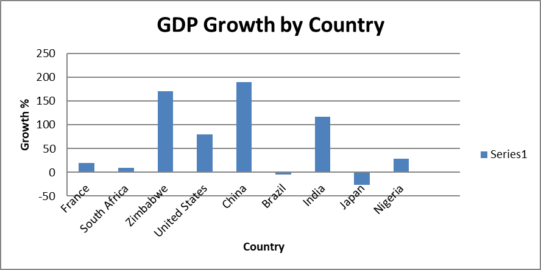
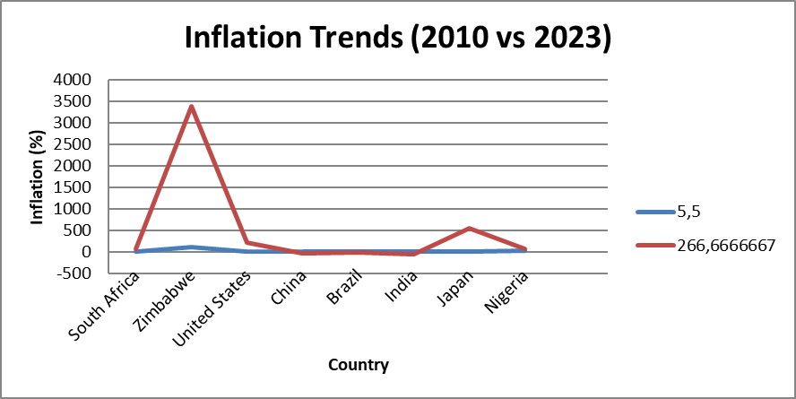

# 🌍 Global Economic Dashboard: Financial Trend Analysis Across 10 Countries (2010–2023)

This Excel dashboard project analyzes key macroeconomic indicators — **GDP**, **GDP per capita**, and **inflation** — across 10 countries using historical data from the **World Bank** (2010–2023). It provides a clear, visual comparison of global financial trends, built with advanced Excel tools and designed for use by analysts, researchers, and decision-makers.

---

## 🚀 Why This Dashboard Matters

Understanding macroeconomic performance is critical in today's interconnected world. This dashboard helps users:
- Compare GDP growth between developed and developing economies  
- Analyze changes in income levels through GDP per capita  
- Track inflation rates and assess their economic impacts  
- Gain insights for policy, investment, or academic purposes  

---

## 📈 Key Features

- **PivotTables & Slicers** for dynamic, interactive filtering  
- **Bar and Line Charts** to visualize trends over time  
- **KPI Cards** to summarize growth rates and highlight top-performing countries  
- **Clean Excel Design** for readability and professional use  

---

## 📊 Indicators Analyzed

- **GDP (current US$)** – Total output of a country’s economy  
- **GDP per capita (current US$)** – Average economic output per person  
- **Inflation (annual %)** – Year-over-year price changes affecting cost of living  
---

## 🌍 Countries Compared

Germany · France · South Africa · Zimbabwe · United States · China · Brazil · India · Japan · Nigeria

---

## 🛠️ Tools & Skills Demonstrated

- **Microsoft Excel (Advanced):** PivotTables, slicers, formulas, KPI cards  
- **Power Query:** For data cleaning and transformation  
- **Data Analysis & Visualization:** Macroeconomic interpretation  
- **Source:** [World Bank Open Data](https://data.worldbank.org/)
## 📸 **Dashboard Preview**
Here’s a snapshot of the dashboard’s visual components:

